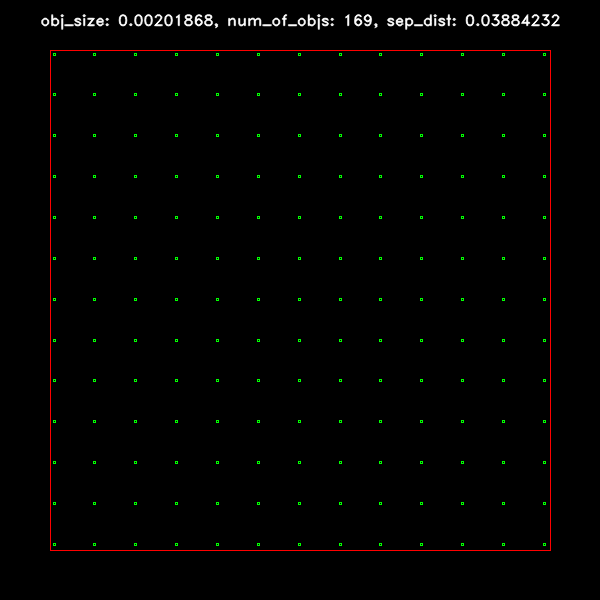
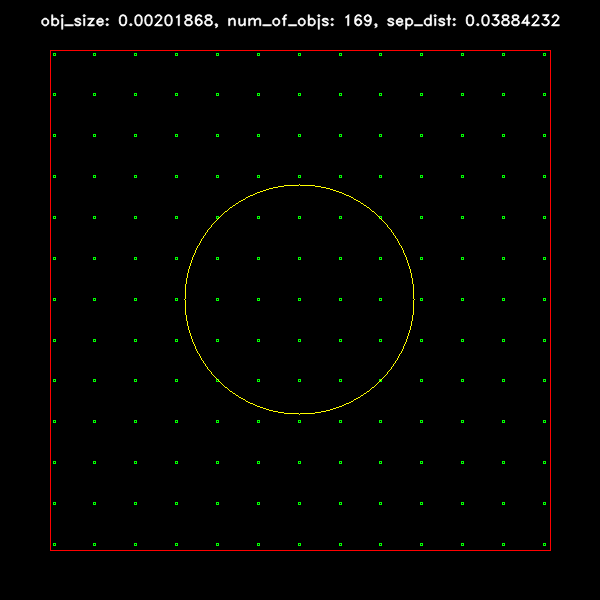

# Electromagnetic aperture design with predefined parameters

The aim of the project was to find optimum aperture parameters. 

Prerequisites of project:
- As many holes as possible
- As large a field of aperature as possible
- Minimum aperture attenuation: 14 dB

My own prerequisites:
- All aperatures have the same size
- Distance between aperatures are fixed
- Used optizer: dummy optimizer
- Frequency used: 1.3 GHz

# Graphical preview of best fit to project requirements plate

<table>
   <tr>
     <td>Example: Plate with 169 aperatures</td>
     <td>Example: Plate with 169 aperatures with cirecle of &lambda; / 2 radius </td>
  </tr>
  <tr>
    <td></td>
    <td></td>
  </tr>
 </table>
 
# Installation: Dependencies

```
pip3 install -r requirements.txt
```

# Run from command line

Help:
```
python3 main.py -h
```
Flags:
```
--iterations, -i   (required)   (default: 1)    Number of iterations for simulation to find best match plate to projet requirements
--visualize,  -v   (optional)                   Generate images of best plate that matches project requirements for each iteration
--debug,      -d   (optional)                   Display more indoramtions about each aperature
--auto,       -a   (optional)                   Automate symualtion for [100, 1.000, 10.000, 100.000, 1.000.000] iterations
```

Exmaple use command
```
python3 -i 1000 -v -d   Single simulation with 1.000 iterations, visualize flag set and debug flag set
python3 -a              Automatic simualition glag set
```

# More info about project and my aproach to problem

Detailed description in polish
```
- Sprawozdnie / Raport:       EBSIS Etap 1 - Opis rozwiązania.pdf
- Prezentacja / Prezentation: EBSIS Etap 1 - Prezentacja.pdf
```
